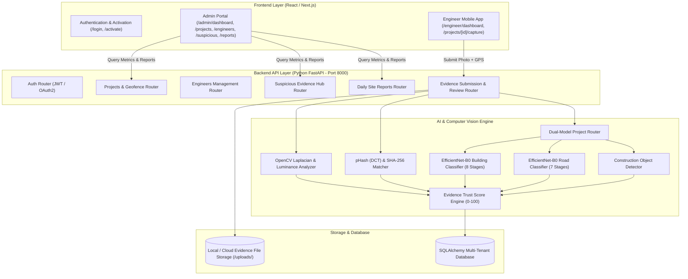

# SiteProof AI — Comprehensive Project Documentation

> **Platform Name:** SiteProof AI  
> **Tagline:** *Verify Work. Validate Evidence. Track Progress.*  
> **Target Audience:** Government Infrastructure Departments (PWD, NHAI, CPWD, Urban Local Bodies) & Commercial EPC Construction Contractors  
> **Primary Technology Stack:** Python (FastAPI, PyTorch, OpenCV, SQLAlchemy) + React / Next.js (TypeScript, TailwindCSS)

---

## 📑 Table of Contents
1. [Executive Summary](#1-executive-summary)
2. [Problem Statement](#2-problem-statement)
3. [The Solving Idea & Core Value Proposition](#3-the-solving-idea--core-value-proposition)
4. [System Architecture & Data Flow](#4-system-architecture--data-flow)
5. [AI & Computer Vision Implementation](#5-ai--computer-vision-implementation)
6. [Evidence Trust Score Formula](#6-evidence-trust-score-formula)
7. [Multi-Tenant Database & Schema Design](#7-multi-tenant-database--schema-design)
8. [User Roles & Functional Workflows](#8-user-roles--functional-workflows)
9. [Deployment & Verification Guide](#9-deployment--verification-guide)
10. [Impact, Business Value & Future Roadmap](#10-impact-business-value--future-roadmap)

---

## 1. Executive Summary

**SiteProof AI** is an enterprise AI-powered visual monitoring, evidence verification, and construction audit platform. It automates the inspection of daily progress photos submitted by field engineers on public works and civil infrastructure projects.

By combining **Live Geofencing (Haversine GPS Verification)**, **OpenCV Computer Vision Focus & Exposure Analysis**, **DCT Perceptual Hashing (Duplicate Prevention)**, and **Dual-Model Deep Learning Stage Classifiers (Building vs. Road)**, SiteProof AI produces a single, explainable **Evidence Trust Score (0–100)** for every photo, guaranteeing authenticity and preventing fraudulent progress claims.

---

## 2. Problem Statement

Public and private infrastructure development represents one of the largest capital expenditures globally. However, construction monitoring suffers from systemic operational vulnerabilities:

### ⚠️ Core Industry Pain Points:
1. **The "Ghost Construction" & Fraudulent Billing Problem**:
   - Contractors and engineers sometimes submit invoices for uncompleted work or non-existent materials.
   - Traditional reporting via WhatsApp, email, or paper logs allows engineers to re-upload old photos, stock photos, or images captured from previous sites.
2. **Geographical Dispersion & Inspection Bottlenecks**:
   - Chief Engineers and Department Admins oversee hundreds of simultaneous sites (roads, bridges, public buildings) spread across thousands of kilometers.
   - Physical site visits are sporadic, creating long blind spots between inspections.
3. **Absence of Objective Visual Auditing**:
   - Photos submitted in traditional workflows are unvalidated. Blurry photos, underexposed shots, or photos taken from arbitrary locations are accepted without algorithmic verification.
4. **Lack of Construction Stage Consistency**:
   - It is difficult to verify whether a submitted photo matches the reported project stage (e.g., claiming *Asphalt Bituminous Layer* when the site is still at *Subgrade Preparation*).
5. **Vulnerability in Regulatory Audits**:
   - In anti-corruption inquiries or quality disputes, organizations cannot prove the exact location, timestamp, and authenticity of visual progress evidence.

---

## 3. The Solving Idea & Core Value Proposition

SiteProof AI solves these problems through an automated, multi-layered verification pipeline:

```
[Field Engineer Capture]
         │
         ▼
[1. Real-Time GPS Geofence Check (Haversine)] ──► Inside Allowed Radius?
         │
         ▼
[2. Cryptographic SHA-256 & 2D-DCT pHash] ──► Duplicate or Re-used Photo?
         │
         ▼
[3. OpenCV Image Quality Analysis] ──► Sharp? Well-Lit? Sufficient Resolution?
         │
         ▼
[4. Dual-Model Deep Learning Stage Router] ──► Matches Building / Road Stage?
         │
         ▼
[5. YOLOv8 Construction Object Detection] ──► Heavy Machinery & Workers Present?
         │
         ▼
[6. Explainable Evidence Trust Score (0–100)] ──► HIGH CONFIDENCE / NEEDS REVIEW / SUSPICIOUS
```

### 💡 Core Pillars of the Solution:
- **Zero-Spoof Location Verification**: Submissions are validated against the project's GPS coordinates and permitted geofence radius ($100\text{m} - 250\text{m}$).
- **Automated Computer Vision Filter**: Instantly rejects or penalizes blurred lenses, dark images, or corrupt files using OpenCV Laplacian variance.
- **Perceptual Duplicate Detection**: Uses 2D Discrete Cosine Transform (`pHash`) to catch images even if cropped, compressed, or resized.
- **Specialized Dual-Model Intelligence**: Distinct neural network classifiers for **Building Construction (8 stages)** and **Road Construction (7 stages)**.
- **Closed-Loop Recapture Workflow**: Suspicious evidence triggers an instant alert on the engineer's mobile dashboard with specific admin recapture instructions.

---

## 4. System Architecture & Data Flow



---

## 5. AI & Computer Vision Implementation

### 1. Dual-Model Stage Classification
The system routes incoming images based on `project_type`:

#### 🏢 Building Construction Model (`EfficientNet-B0 Building`):
- **Stage 1**: `SITE_PREPARATION` (Land clearing, boundary setup)
- **Stage 2**: `EXCAVATION` (Earth removal, trenching)
- **Stage 3**: `FOUNDATION` (Pebble beds, rebar cages, concrete pouring)
- **Stage 4**: `STRUCTURAL_WORK` (Columns, beams, slabs, scaffolding)
- **Stage 5**: `BRICKWORK_MASONRY` (Brick / AAC block wall construction)
- **Stage 6**: `PLASTERING` (Cement plastering, internal/external surfaces)
- **Stage 7**: `FINISHING` (Flooring, painting, electrical/plumbing fittings)
- **Stage 8**: `COMPLETED` (Ready for handover / occupancy)

#### 🛣️ Road Construction Model (`EfficientNet-B0 Road`):
- **Stage 1**: `SITE_PREPARATION` (Right-of-way clearance)
- **Stage 2**: `EARTHWORK` (Cut & fill operations, leveling)
- **Stage 3**: `SUBGRADE_PREPARATION` (Compacted soil foundation)
- **Stage 4**: `GRANULAR_SUBBASE` (GSB crushed stone spreading)
- **Stage 5**: `BASE_COURSE` (WMM / Dense Bituminous Macadam)
- **Stage 6**: `ASPHALT_BITUMINOUS_LAYER` (Hot-mix asphalt rolling)
- **Stage 7**: `FINISHED_ROAD` (Road marking, lane painting, signage)

### 2. OpenCV Image Quality Analysis
- **Blur & Sharpness Estimation**:
  $$\text{Blur Variance} = \text{Var}\left(\nabla^2 f_{\text{gray}}\right)$$
  - $\text{Variance} \ge 40.0$: Sharp, high-quality image.
  - $\text{Variance} < 20.0$: Flagged as blurry or out of focus.
- **Exposure & Lighting Check**:
  - Computes mean grayscale luminance ($\mu$).
  - Underexposed: $\mu < 45.0$ / Overexposed: $\mu > 220.0$.

### 3. Perceptual Duplicate Hashing (`pHash`)
- Computes 2D Discrete Cosine Transform on a $32 \times 32$ matrix.
- Extracts the top $8 \times 8$ low-frequency coefficients and generates a 64-bit fingerprint.
- Compares against previous submissions using Hamming Distance ($D_H \le 10 \implies \text{Near Duplicate}$).

---

## 6. Evidence Trust Score Formula

Every submitted image is evaluated using a multi-signal scoring model ($0 \le \text{Score} \le 100$):

$$\text{Trust Score} = S_{\text{GPS}} + S_{\text{Accuracy}} + S_{\text{Quality}} + S_{\text{Uniqueness}} + S_{\text{Category}} + S_{\text{Confidence}}$$

| Dimension | Points Allocated | Scoring Criteria |
|---|---|---|
| **Location Verification ($S_{\text{GPS}}$)** | $0\text{ to }30$ | $+30$ if distance $\le$ allowed geofence radius; $0$ if outside. |
| **GPS Accuracy ($S_{\text{Accuracy}}$)** | $0\text{ to }10$ | $+10$ if accuracy $\le 20\text{m}$; $+5$ if $\le 50\text{m}$; $0$ if $> 50\text{m}$. |
| **Image Quality ($S_{\text{Quality}}$)** | $0\text{ to }20$ | $+20$ for sharp, well-lit image; penalized for blur or poor exposure. |
| **Uniqueness ($S_{\text{Uniqueness}}$)** | $0\text{ to }20$ | $+20$ for unique photo; $-25$ penalty if exact SHA-256 duplicate. |
| **Category Adherence ($S_{\text{Category}}$)** | $0\text{ to }10$ | $+10$ if photo matches 1 of 5 daily guided checklist categories. |
| **AI Stage Confidence ($S_{\text{Confidence}}$)** | $0\text{ to }10$ | $+10$ if model classification confidence $\ge 0.85$; $+5$ if $\ge 0.70$. |

### Status Thresholds:
- 🟢 **80 – 100 Points**: `HIGH CONFIDENCE` (Auto-verified, green badge)
- 🟡 **50 – 79 Points**: `NEEDS REVIEW` (Enters supervisor inspection queue)
- 🔴 **0 – 49 Points**: `SUSPICIOUS` (Flagged immediately to Suspicious Hub)

---

## 7. Multi-Tenant Database & Schema Design

All tables enforce tenant isolation using `organization_id`:

```
┌─────────────────────────────────┐
│          Organizations          │
│ (id, name, type, active, etc.)  │
└───────────────┬─────────────────┘
                │ 1:N
        ┌───────┴───────────────────────┐
        ▼                               ▼
┌───────────────┐               ┌───────────────┐
│     Users     │               │   Projects    │
│ (ADMIN / ENG) │               │(BUILDING/ROAD)│
└───────┬───────┘               └───────┬───────┘
        │                               │
        │ 1:N                           │ 1:N
        ▼                               ▼
┌───────────────────────────────────────────────┐
│                 SiteEvidence                  │
│  (id, project_id, engineer_id, image_path,    │
│   image_hash, p_hash, latitude, longitude,   │
│   location_verified, trust_score, status)     │
└───────┬───────────────────────────────┬───────┘
        │ 1:1                           │ 1:N
        ▼                               ▼
┌──────────────────┐            ┌──────────────────┐
│ EvidenceAnalysis │            │ SuspiciousEvents │
│ (predicted_stage,│            │ (issue_type,     │
│  detected_objects│            │  risk_score,     │
│  quality_score,  │            │  recapture_reason│
│  trust_score)    │            │  status)         │
└──────────────────┘            └──────────────────┘
```

---

## 8. User Roles & Functional Workflows

### 👨‍💼 Role 1: Department Administrator
- **Dashboard Overview**: Live operational metrics, active project count, suspicious alert banners.
- **Project Configuration**: Define Building/Road project, set GPS coordinates, geofence radius (e.g. 150m), and daily photo quotas.
- **Staff Onboarding**: Add engineers with official email/employee ID and generate one-click invitation tokens.
- **Evidence Review Gallery**: Inspect submitted evidence with AI stage predictions, detected machinery, and full-screen image inspection.
- **Suspicious Evidence Hub**: Review anomaly events (duplicate photos, perimeter breaches) and issue **Recapture Requests** with detailed instruction notes.
- **Daily Site Digests**: View and export consolidated progress reports.

### 👷‍♂️ Role 2: Field Engineer (Mobile-First Interface)
- **Dashboard**: View assigned sites, today's submission progress meter, and urgent Recapture alerts.
- **5-Category Guided Checklist**:
  1. *Wide Site View* (Overall site perimeter)
  2. *Active Work Area* (Main ongoing activity)
  3. *Different Work Section* (Secondary section / elevation)
  4. *Equipment & Materials* (Machinery, inventory)
  5. *Progress Close-Up* (Detailed quality / finish work)
- **Live Capture**: Browser camera stream with real-time GPS distance radar and allowed radius verification.
- **Instant AI Feedback**: Immediate post-capture modal displaying Evidence Trust Score, stage prediction, and detected equipment tags.

---

## 9. Deployment & Verification Guide

### Prerequisites
- Python 3.10+ (with `fastapi`, `uvicorn`, `sqlalchemy`, `opencv-python`, `torch`, `torchvision`, `pillow`, `numpy`)
- Node.js 18+ (with `next`, `react`, `lucide-react`, `tailwindcss`)

### Starting the Stack Locally

#### Terminal 1: Python FastAPI Backend
```powershell
cd backend
python run.py
```
> *API Docs:* **`http://localhost:8000/docs`**

#### Terminal 2: React / Next.js Frontend
```powershell
npm run dev
```
> *App URL:* **`http://localhost:3000`**

### Running Automated E2E Tests
```powershell
cd backend
python test_e2e.py
```
*(Runs 16 end-to-end integration tests verifying Admin Init, Login, Live Capture, AI Stage Classifier, Trust Score calculation, Duplicate Flagging, Recapture Alerts, and Daily Reports).*

---

## 10. Impact, Business Value & Future Roadmap

### 📈 Quantifiable Impact:
- **100% Elimination of Fake / Recycled Photos**: Cryptographic hashing and perceptual fingerprinting prevent re-submission of historical images.
- **90% Reduction in Manual Inspection Overhead**: Admins focus only on photos flagged as `NEEDS REVIEW` or `SUSPICIOUS`.
- **Tamper-Proof Audit Trail**: Every piece of evidence contains immutable GPS coordinates, server-validated timestamps, and classification records.
- **Accelerated Project Turnaround**: Fast approval of genuine work stages allows timely contractor disbursements and keeps infrastructure schedules on track.

### 🔮 Future Roadmap:
1. **Drone Aerial Photogrammetry Integration**: Ingesting high-resolution drone orthomosaics for 3D volumetric earthwork estimation.
2. **Offline-First Mobile PWA**: SQLite local synchronization for remote construction sites with intermittent cellular connectivity.
3. **BIM (Building Information Modeling) 4D Sync**: Overlaying actual AI-predicted visual stages against Autodesk Revit / IFC 4D construction schedule models.
